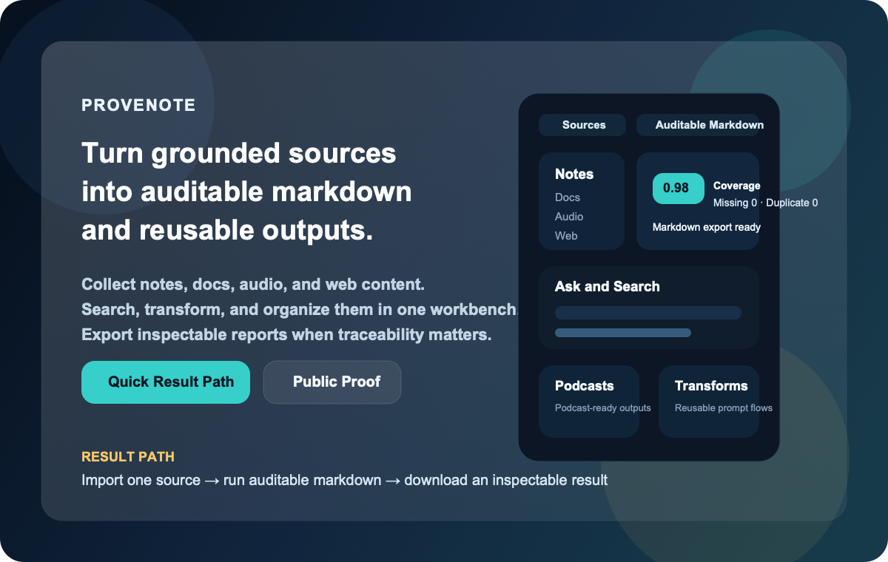
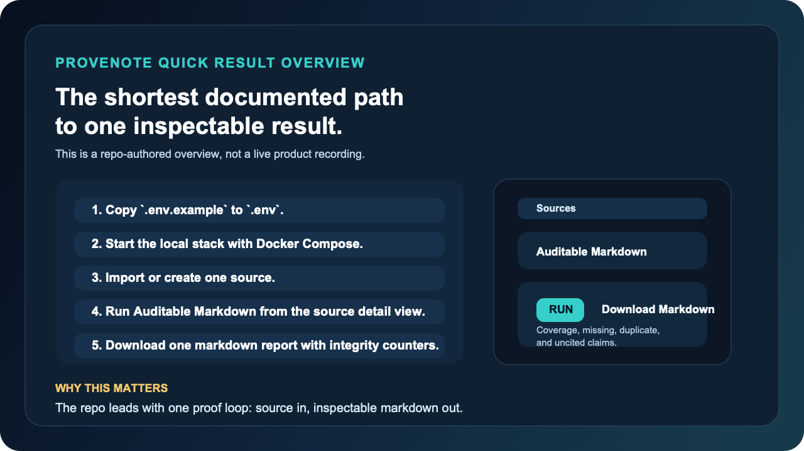
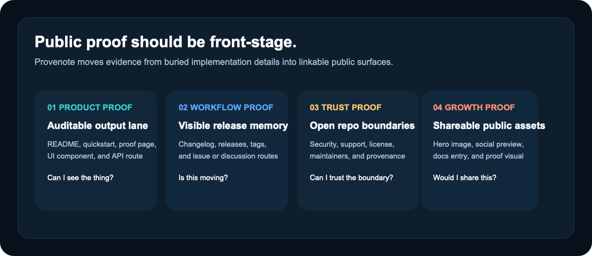
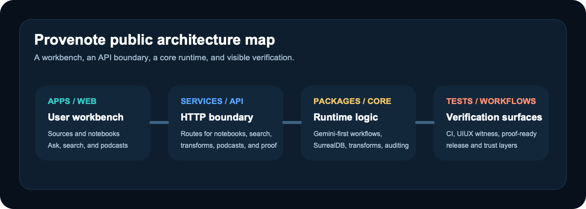

# Provenote

<div align="center">
  <p>
    <strong>Messy long context -> structured insight -> notes, research threads, and inspectable outcomes.</strong>
  </p>
  <p>
    <a href="https://github.com/xiaojiou176-open/provenote/discussions"></a>
    <a href="./LICENSE"></a>
    <a href="./docs/quickstart.md"></a>
    <a href="./docs/proof.md"></a>
  </p>
  <p>
    <a href="./docs/quickstart.md"><strong>Quick Result Path</strong></a>
    ·
    <a href="./docs/use-cases/long-context-to-structured-notes.md"><strong>Long Context</strong></a>
    ·
    <a href="./docs/proof.md"><strong>Public Proof</strong></a>
    ·
    <a href="./docs/project-status.md"><strong>Project Status</strong></a>
    ·
    <a href="./docs/index.md"><strong>Docs</strong></a>
  </p>
  <p>
    <a href="./docs/mcp.md"><strong>MCP & Integrations</strong></a>
    ·
    <a href="./examples/hosts/README.md"><strong>Starter Bundles</strong></a>
    ·
    <a href="./docs/distribution.md"><strong>Distribution</strong></a>
    ·
    <a href="./docs/faq.md"><strong>FAQ</strong></a>
    ·
    <a href="https://github.com/xiaojiou176-open/provenote/discussions"><strong>Discussions</strong></a>
  </p>
  <p>
    Star Provenote if you want a source-heavy AI workbench that stays inspectable after the chat scrollback is gone.
  </p>
</div>





This illustrated overview is a repo-authored summary of the shortest documented path. It is intentionally not presented as a live product recording.

> Canonical product path:
> `messy long context -> structured insight -> note / research thread / draft -> inspectable outcome`

That is the first door. MCP, starter bundles, distribution pages, and promotion assets are valuable second-ring surfaces, but they should not outrank the product path.

## Start Here In 10 Seconds

If you only want the fastest honest map, use this:

| Question | Open this first | Why |
| --- | --- | --- |
| "Can this help with messy long context?" | [Long Context](./docs/use-cases/long-context-to-structured-notes.md) | This is the product center, not a side use case. |
| "Can I get one real result quickly?" | [Quick Result Path](./docs/quickstart.md) | This is the shortest repo-documented local proof loop. |
| "Is this real or just copywriting?" | [Public Proof](./docs/proof.md) | This is the evidence layer. |
| "What is still intentionally unclaimed?" | [Project Status](./docs/project-status.md) | This is the boundary page. |

Judge the workbench before you judge the side doors. MCP pages, starter bundles, distribution packs, and promotion assets matter, but they are second-layer surfaces around the main product path.

## Why Provenote Exists

Most AI note tools make it easy to generate words and hard to verify where those words came from.

That gets even worse when the raw material is long and messy: a huge chat log, a copied forum thread, a meeting recap, or a web page pile you do not want to flatten into one more throwaway summary.

Provenote is built for the opposite direction:

- collect notes, documents, audio, and web content in one place
- structure long context before it disappears into another chat turn
- search and ask across that material without losing the source trail
- turn high-value source work into auditable markdown with integrity counters
- keep the whole workflow repository-documented and reproducible

Think of it like moving from a loose pile of research tabs to a workbench with labeled drawers, measuring tools, and a clean export lane.

If your problem starts as "I have too much messy context," the strongest current repo-backed answer is not another empty chat box. It is the path from long context to structured notes and then into reusable outcome objects.

## If You Start With Messy Long Context

The strongest current first-entry path is:

```text
Import the source
-> Run Chat Knowledgeization
-> Inspect the structured insight
-> Continue it as a note or notebook research thread
-> Keep draft work inside the notebook lane
```

In plain language: first turn the pile into labeled folders, then decide whether it belongs in your notes, your active research lane, or your notebook draft workflow.

## What You Can Do In One Workbench

- **Collect grounded context**: bring in text, files, audio, and web sources instead of starting every session from a blank chat box.
- **Structure long context before chatting more**: use built-in transformations such as **Chat Knowledgeization** when the material starts as long chat logs, forum threads, meeting notes, or copied web discussions.
- **Keep structured results moving**: after long-context structuring, continue the result into a note, a notebook research thread, or the notebook draft lane instead of leaving the insight stranded.
- **Search and think with structure**: move between notebooks, ask/search flows, transformations, and model settings without hopping across disconnected tools.
- **Create outputs with receipts**: use the auditable markdown lane when you need stronger traceability than ordinary chat alone, or create notebook-level drafts plus export bundles when you need a reusable outcome object you can hand off.
- **Hand outcomes off cleanly**: download draft markdown when you only need the text, or export a richer draft bundle when you need metrics, claim/section review data, PID summaries, and source manifest context together.
- **Go beyond text-only workflows**: generate podcast-ready outputs and reusable transformations from the same source base.
- **Bring it into coding agents through MCP**: expose notebooks, sources, drafts, research threads, and auditable runs to Claude Code, OpenAI Codex, Cursor, and other MCP-capable hosts through a first-party MCP server.
- **Run the same outcome lanes from a terminal/operator surface**: use the first-party `provenote` CLI when you want notebook outcome inspection, auditable markdown, or research-thread-to-draft handoffs without treating MCP host setup as the only operator path.

If you only remember one first-entry rule, make it this:

```text
messy long context
-> structured insight
-> note / seeded research lane / notebook research thread
-> draft-adjacent notebook work
```

That is the product center. MCP host pages come after that path, not before it.

## Ecosystem Boundary

Think of these surfaces like rooms around the main workshop:

- host guides are the side doors
- the CLI is the tool cart
- the main workbench is still the path from messy context to reusable outcomes

| Surface | What it is today | What it is not |
| --- | --- | --- |
| Claude Code / Codex / Cursor / OpenCode pages | repo-backed compatibility guides through the first-party MCP server, with public-ready starter bundles under `examples/hosts/` | official partnership, bundled integration, plugin, or marketplace listing |
| `provenote` CLI | a first-party local operator surface for outcome inspection and `research_thread -> draft -> verify/download` workflows | a separate distributed product line or a renamed MCP server |
| public skills surface | not currently a shipped public product surface in this repository | a skills catalog, skills marketplace, or host-specific skills program claim |
| OpenClaw | public-ready OpenClaw-compatible bundles and a ClawHub submission pack live under `examples/hosts/openclaw` | an official ClawHub or community listing that is already live |
| release / listing / domain / trademark / partnership | external decision and publication work | completed repo-side truth |

If you want the shortest public page that keeps those boundaries honest, start with [docs/project-status.md](./docs/project-status.md).

If you want repo-owned install artifacts instead of prose-only setup pages, start with [examples/hosts/README.md](./examples/hosts/README.md). That index points to the public-ready Claude Code, Codex, Cursor, and OpenCode starter bundles plus the OpenClaw-compatible bundles and the ClawHub submission pack.

If you want the full claim ladder instead of inferring it from scattered host pages, use [docs/distribution.md](./docs/distribution.md).

## Distribution Status

| Surface | Current rung | Safe wording now |
| --- | --- | --- |
| Claude Code | `public-ready package available` | Provenote works with Claude Code via MCP, and this repository ships a public-ready starter bundle |
| OpenAI Codex | `public-ready package available` | Provenote works with OpenAI Codex via MCP, and this repository ships a public-ready starter bundle |
| OpenClaw | `public-ready package available` plus `submission-ready pack` | Provenote ships public-ready OpenClaw-compatible bundles and a ClawHub submission pack; no live listing is claimed |
| Official MCP Registry | `repo-owned prep exists` | the registry exists, but Provenote is not listed there today and publication still needs a registry package plus publisher auth |

If you want the full claim ladder and distribution matrix, use [docs/distribution.md](./docs/distribution.md).

## Pick A Package Path

If you already know which host or submission surface you care about, start from the checked-in package path instead of hunting across docs first.

| If you want to start with... | Open this first | What you get immediately |
| --- | --- | --- |
| Claude Code | [examples/hosts/claude-code/provenote-outcome-bundle/README.md](./examples/hosts/claude-code/provenote-outcome-bundle/README.md) | project-scoped MCP config, commands, skill, and a read-first verify loop |
| OpenAI Codex | [examples/hosts/codex/provenote-outcome-bundle/README.md](./examples/hosts/codex/provenote-outcome-bundle/README.md) | bundle-local MCP config, `config.toml.example`, skill, and install guidance |
| OpenClaw / ClawHub prep | [examples/hosts/openclaw/README.md](./examples/hosts/openclaw/README.md) | the three OpenClaw-compatible bundle families plus the current submission pack |
| Official MCP Registry prep | [examples/public-distribution/mcp-registry/README.md](./examples/public-distribution/mcp-registry/README.md) | the current registry submission pack, mirrored `server.json`, and the exact repo-owned boundary |

## Choose Your First Doorway

If you are deciding where to start, use the doorway that matches your actual problem instead of walking through every page in order.

| If you are arriving with... | Start here | Why this is the strongest current path |
| --- | --- | --- |
| one long messy chat, note dump, or copied web thread | [docs/use-cases/long-context-to-structured-notes.md](./docs/use-cases/long-context-to-structured-notes.md) | it keeps the product centered on `messy context -> structured insight -> durable next step` |
| a source-grounded research or memo job | [docs/use-cases/source-grounded-ai-research.md](./docs/use-cases/source-grounded-ai-research.md) | it shows the notebook, research-thread, draft, and verify ladder without making MCP the front door |
| a coding-agent host you already use every day | [docs/mcp.md](./docs/mcp.md) | it routes you into the first-party MCP server and the host guides while keeping partnership/plugin language out of the story |
| a checked-in host bundle you can install from public docs | [examples/hosts/README.md](./examples/hosts/README.md) | it gives you public-ready Claude Code / Codex / Cursor / OpenCode starter bundles plus OpenClaw-compatible bundles and the ClawHub submission pack instead of only setup prose |
| a distribution/readiness answer instead of another host-by-host scavenger hunt | [docs/distribution.md](./docs/distribution.md) | it separates `repo-owned prep`, `public-ready package available`, `publicly discoverable listing live`, and `official marketplace listing live` so packaging claims stay honest |
| a terminal or operator task | [docs/runbooks/operator-cli.md](./docs/runbooks/operator-cli.md) | it starts from the first-party `provenote` command instead of forcing the MCP path to do every job |
| a release, readiness, or external promotion question | [docs/project-status.md](./docs/project-status.md) | it keeps repo-ready truth, public truth, and owner-only publication actions in separate buckets |

## Why This Feels Different

| If you care about... | Generic chat-over-files feel | Provenote's current public surface |
| --- | --- | --- |
| Working from organized source material | often flat and session-scoped | sources, notebooks, search, and transformations in one workbench |
| Outputs you can inspect after the chat ends | often reply-first and ephemeral | downloadable auditable markdown with visible integrity counters |
| Self-hosted control | varies by tool | repo-documented local stack with a public runtime contract |
| Knowing who owns support and review | often blurry in forks | repo-local stewardship, support, security, and contribution surfaces |

## Product Truth Boundary

Ordinary chat and ask flows are a fast assistant surface for exploration and iteration.

When you need stronger traceability, the stricter product truth lane now has two inspectable layers:

- source-level auditable markdown and auditable-runs for strict single-source verification
- notebook-level drafts for reusable multi-source outcome building inside a notebook

## Choose The Right Carry-Forward Surface

Once the core outcome path is clear, use the surface that matches the job:

| If you want to... | Start here | Why |
| --- | --- | --- |
| keep moving inside the workbench | [docs/quickstart.md](./docs/quickstart.md) and [docs/use-cases/long-context-to-structured-notes.md](./docs/use-cases/long-context-to-structured-notes.md) | best fit when the work still starts from messy context and reusable outcome objects |
| bring the same outcome objects into coding agents | [docs/mcp.md](./docs/mcp.md) | MCP is the carry-forward integration surface after the product path is clear |
| run the same lanes from a terminal | [docs/runbooks/operator-cli.md](./docs/runbooks/operator-cli.md) | the first-party CLI exposes operator workflows without pretending host setup is the only door |
| check what is intentionally not claimed | [docs/project-status.md](./docs/project-status.md) | the status boundary keeps OpenClaw, plugin, marketplace, and public Skills language honest |

That ordering is intentional. Host guides, the CLI, and future packaging questions sit around the workbench. They do not replace the workbench.

## Quick Result Path

This path optimizes for the first visible result, not full system mastery.

Think of it as the fastest repo-documented local proof loop, not a one-minute hosted trial.

In plain language: this is a **5 to 10 minute local proof loop**, not a hosted one-minute trial.

1. Copy the local environment template and add the two fast-path values.

   ```bash
   cp .env.example .env
   ```

   Fast-path values:

   ```bash
   OPEN_NOTEBOOK_ENCRYPTION_KEY=change-me-to-a-secret-string
   GEMINI_API_KEY=your-google-ai-studio-key
   ```

2. Start the default local stack.

   ```bash
   docker compose -f ops/compose/docker-compose.yml up -d --build
   ```

   On this Docker fast path, Compose injects the SurrealDB connection defaults and a known-good fast-path Gemini model for you. That is why the first visible result path only asks you to set the encryption key and Gemini key up front.

3. Open `http://localhost:8502`, create or import a source, and move into the source detail view.

4. Run **Auditable Markdown** to generate a downloadable markdown report with integrity counters.
5. Open a notebook and create a **Draft** if you want a reusable notebook-level outcome instead of a single-source artifact.

If you want the full walkthrough, go straight to [docs/quickstart.md](./docs/quickstart.md).
If you want a zero-setup hosted product, this repository is not promising that experience today.

If you prefer a terminal-first operator path once the local stack is up, use the narrow first-party operator runbook in [docs/runbooks/operator-cli.md](./docs/runbooks/operator-cli.md). That surface is intentionally outcome-first and does not replace the workbench UI or the MCP compatibility pages.

If you want the ecosystem boundary before you read host pages, use [docs/project-status.md](./docs/project-status.md).

## Runtime Cleanup Operator Path

Provenote treats disk cleanup as a governed operator path, not an ad-hoc "delete big folders" exercise.

- Repo-local dependency root: `apps/web/node_modules`
  - This path is a repo-owned rebuildable dependency tree.
  - It is **not** a shared machine cache.
  - Clearing it is allowed only through the repo-local cleanup contract, and the rebuild command is `cd apps/web && npm ci`.
- Repo-related machine cache examples:
  - `${HOME}/.cache/provenote/...`
  - `${HOME}/.cache/provenote/python/uv-cache`
  - `${HOME}/.cache/provenote/playwright/ms-playwright`
  - `${HOME}/.cache/provenote/ci-host/npm-cache`
  - these are the only repo-specific machine-level download caches that should remain outside the checkout.
  - entrypoint wrappers now auto-run the repo-owned machine-cache cleanup lane so stale cache roots and oversized download caches do not silently accumulate forever.
- Repo-local CI/runtime residue:
  - `.runtime-cache/venv/default`
  - `.runtime-cache/ci-host/...`
  - these are repo-owned runtime or bootstrap surfaces and must stay inside the checkout rather than leaking into machine-wide cache roots.
- Shared tool caches remain advisory-only:
  - `${HOME}/.cache/uv`
  - `${HOME}/.npm`
  - `${HOME}/Library/Caches/ms-playwright`
  - `${HOME}/Library/Containers/com.docker.docker`
  - `${HOME}/.docker`
  - these are related to the repo, but they are not repo-exclusive and must not be auto-cleared by Provenote entrypoints.
- Docker runtime surfaces:
  - local `open-notebook-ci:*` images
  - buildx builders / BuildKit containers
  - Docker build cache reported by `docker system df -v`
  - these belong to the Docker operator path, not the repo-local `cleanup_runtime_cache.sh` lane

Use the explicit operator flow:

```bash
make cleanup-operator-audit
make cleanup-operator-apply
```

That operator flow is intentionally split:

- `cleanup_runtime_cache.sh` handles repo-local runtime/cache surfaces
- `cleanup_machine_cache.sh` handles the remaining repo-related download caches under `~/.cache/provenote`
- entrypoint wrappers (`run_uv_managed.sh`, `run-playwright-managed.sh`, and `run_in_consistent_container.sh`) invoke that machine-cache lane in apply mode so repo-specific external caches obey TTL/cap/root-cap policy by default
- `docker-buildx-clean` / `docker-runtime-audit` cover repo-related Docker builder and image surfaces

## Real Result, Not Just Positioning

This is the fastest concrete proof path in the current repo surface:

| Evidence lane | What goes in | What comes out | What you can inspect |
| --- | --- | --- | --- |
| Auditable Markdown | one imported source from text, file, audio, or web content | a downloadable markdown report | coverage-oriented integrity counters plus a direct markdown download path |
| Notebook Drafts | multiple notebook-linked sources | a downloadable notebook-level markdown draft plus export bundle | draft versions, section/claim inspection, bundle export, and notebook outcome state |

The current UI and API evidence behind that lane is already public:

- the workbench exposes an **Auditable Markdown** panel with **Run** and **Download Markdown** actions
- the panel surfaces **Coverage Rate**, **Missing**, **Duplicate**, **Uncited Claims**, **Unknown PID**, and **Unclassified**
- the API publishes auditable-run routes behind the same workflow

Start from [docs/proof.md](./docs/proof.md) if you want the file-and-route evidence behind those claims.

If you want a fixed, reproducible local proof loop, use the [public proof pack](./examples/public-proof/auditable-markdown/README.md).

### Sanitized result shape

```text
# Auditable Markdown Report

## Source
- title: Example imported source
- lane: auditable markdown

## Integrity Counters
- coverage_rate: 0.98
- missing_count: 0
- duplicate_count: 0
- uncited_claims_count: 0

## Output
- downloadable markdown report
- inspectable sections and claims
- stronger traceability than a plain chat reply
```

This is a sanitized result shape, not a copied user artifact. The concrete product evidence for the lane lives in the current UI panel and auditable-run API surface.

## Why People Star Provenote Now

- **You want a repo-documented workbench, not another single chat pane**. Provenote already combines sources, notebooks, search, transformations, podcasts, and an auditable output lane in one repo surface.
- **You care about source-grounded writing that leaves receipts**. The auditable markdown lane is a stronger hook than generic "AI notes" because it points people toward inspectable output, not only generated text.
- **You want a repo worth revisiting, not a one-time curiosity**. Releases, changelog, proof surfaces, and docs make it easier to track visible progress over time.
- **You want a fork that acts like a real public product surface**. Provenance still matters, but the current support, review, and stewardship boundary is repository-local and documented.

## Why Watch Provenote Over Time

- **The repo exposes proof surfaces, not only roadmap language**. README, proof, changelog, release notes, and issue/discussion routing all work together as public evidence layers.
- **The product shape is already broader than one feature spike**. The current surface spans collection, search, research threads, notebooks, transformations, podcasts, source QA, and auditable outputs.
- **The current fork boundary is explicit**. That makes progress easier to interpret because support, review, and stewardship are not hidden behind upstream ambiguity.

## Public Proof, Not Vibes



If you want proof before commitment, start here:

| What you want to verify | Where to look |
| --- | --- |
| The product is wider than a single chat screen | [docs/proof.md](./docs/proof.md) |
| The fastest path to a real result | [docs/quickstart.md](./docs/quickstart.md) |
| How to use it from coding agents | [docs/mcp.md](./docs/mcp.md) |
| The current scope and readiness boundary | [docs/project-status.md](./docs/project-status.md) |
| The current release story | [CHANGELOG.md](./CHANGELOG.md) and [GitHub Releases](https://github.com/xiaojiou176-open/provenote/releases) |
| The runtime shape | [docs/architecture.md](./docs/architecture.md) |
| The support and security boundary | [SUPPORT.md](./SUPPORT.md) and [SECURITY.md](./SECURITY.md) |

Release visibility is one public signal, not automatic proof that the latest release-event build and asset set are clean.

## Docs By Goal

| If your goal is... | Start here | Then go deeper with... |
| --- | --- | --- |
| Evaluate whether Provenote is worth your attention | [README.md](./README.md) | [docs/proof.md](./docs/proof.md), [docs/faq.md](./docs/faq.md) |
| Get to a first visible result quickly | [docs/quickstart.md](./docs/quickstart.md) | [docs/installation.md](./docs/installation.md), [docs/configuration.md](./docs/configuration.md) |
| Connect it to coding agents through MCP | [docs/mcp.md](./docs/mcp.md) | [docs/integrations/claude-code.md](./docs/integrations/claude-code.md), [docs/integrations/codex.md](./docs/integrations/codex.md), [docs/integrations/cursor.md](./docs/integrations/cursor.md), [docs/integrations/opencode.md](./docs/integrations/opencode.md) |
| Understand concrete outcome-first use cases | [docs/use-cases/long-context-to-structured-notes.md](./docs/use-cases/long-context-to-structured-notes.md) | [docs/use-cases/source-grounded-ai-research.md](./docs/use-cases/source-grounded-ai-research.md), [docs/use-cases/ai-notes-with-receipts.md](./docs/use-cases/ai-notes-with-receipts.md), [docs/use-cases/source-grounded-drafts.md](./docs/use-cases/source-grounded-drafts.md), [docs/use-cases/source-to-verified-draft.md](./docs/use-cases/source-to-verified-draft.md) |
| Understand the system shape | [docs/architecture.md](./docs/architecture.md) | [services/api/main.py](./services/api/main.py), [apps/web/src/components/layout/AppSidebar.tsx](./apps/web/src/components/layout/AppSidebar.tsx) |
| Contribute safely | [CONTRIBUTING.md](./CONTRIBUTING.md) | [docs/development.md](./docs/development.md), [MAINTAINERS.md](./MAINTAINERS.md) |
| Understand the current naming and domain boundary | [docs/brand-domain.md](./docs/brand-domain.md) | [docs/faq.md](./docs/faq.md), [docs/mcp.md](./docs/mcp.md) |

## Use It With Coding Agents

Provenote ships a first-party MCP server so you can bring the same outcome objects you use in the web workbench into coding-agent hosts.

If your starting problem is messy long context, start with [Long Context](./docs/use-cases/long-context-to-structured-notes.md) first and come back here when you want to carry those outcome objects into a host.

Current public fit:

- use Provenote with Claude Code through MCP
- use Provenote with OpenAI Codex through MCP
- use Provenote with Cursor through MCP
- use Provenote with OpenCode through MCP

Current boundary:

- this is a compatibility surface, not an official vendor partnership
- vendor names are used descriptively to show host targets
- the product center is still Provenote's auditable/source-grounded outcome path, not the MCP control plane by itself

Start with [docs/mcp.md](./docs/mcp.md) if you want the MCP overview, then choose the host-specific page that matches your agent runtime.

If you want checked-in starter artifacts instead of only setup pages, go straight to [examples/hosts/README.md](./examples/hosts/README.md). That index links the public-ready Claude Code, Codex, Cursor, and OpenCode starter bundles plus the OpenClaw-compatible bundles and the ClawHub submission pack.

## Product Surface At A Glance

The main workbench currently spans:

- **Collect**: sources and notebooks
- **Process**: ask/search and transformations
- **Create**: podcasts, notebook drafts, and auditable markdown
- **Manage**: models, settings, advanced controls, and repo-local governance



## Best Fit And Not The Best Fit

**Provenote is a strong fit if you want to:**

- turn notes, documents, audio, and web sources into inspectable markdown outputs
- run a repository-documented research workbench instead of depending on a hosted SaaS
- evaluate a NotebookLM-like surface that already includes notebooks, search, podcasts, and auditable output paths
- follow a repo that publishes proof surfaces, release surfaces, and stewardship boundaries in public

**Provenote is probably not the best fit if you want:**

- a zero-setup hosted product with no local runtime or Docker involvement
- a multi-provider runtime by default today
- a tiny single-purpose summarizer or export-only utility
- a repo that hides fork lineage or blurs who currently owns support and review

## Brand And Lineage

Provenote is the public identity of this repository.

This repository is a deep, productized fork of the upstream Open Notebook project.

Upstream lineage still matters for provenance, but the current support, review, release, and collaboration surface is repository-local to this checkout.

That means two things can both be true at once:

- Provenote is the brand people should remember
- upstream lineage still belongs in the evidence layer, not the headline

The repo-local stewardship and trust boundary is anchored in [NOTICE.md](NOTICE.md), [MAINTAINERS.md](MAINTAINERS.md), [SUPPORT.md](SUPPORT.md), [SECURITY.md](SECURITY.md), and [CONTRIBUTING.md](CONTRIBUTING.md).

## Local Cleanup Operator Path

When disk pressure comes from local Docker builders plus repo-local rebuildables,
use one explicit operator path instead of guessing which command owns which
surface:

```bash
make cleanup-operator-dry-run
make cleanup-operator-rebuildable
make cleanup-operator-aggressive
```

That split is intentional:

- `docker-buildx-clean` handles local Buildx/builder residue
- `tooling/scripts/ops/cleanup_runtime_cache.sh` handles repo-local runtime and rebuildable surfaces
- `apps/web/node_modules` remains a repo-local rebuildable dependency root, not a machine cache
- repo-related machine caches still stay review-first instead of being auto-cleared by repo automation, and they are limited to download-cache surfaces only

## Community

- **Questions and product discussion**: GitHub Discussions
- **Reproducible bugs and scoped improvements**: GitHub Issues
- **Contribution flow**: [CONTRIBUTING.md](./CONTRIBUTING.md)
- **Support boundary**: [SUPPORT.md](./SUPPORT.md)
- **Security reporting**: [SECURITY.md](./SECURITY.md)
- **Collaboration conduct**: [CODE_OF_CONDUCT.md](CODE_OF_CONDUCT.md)
- **Current review routing**: [CODEOWNERS](CODEOWNERS)
- **Stewardship and provenance**: [NOTICE.md](./NOTICE.md) and [MAINTAINERS.md](./MAINTAINERS.md)

## License

This fork continues to distribute upstream-licensed material under [LICENSE](./LICENSE).
